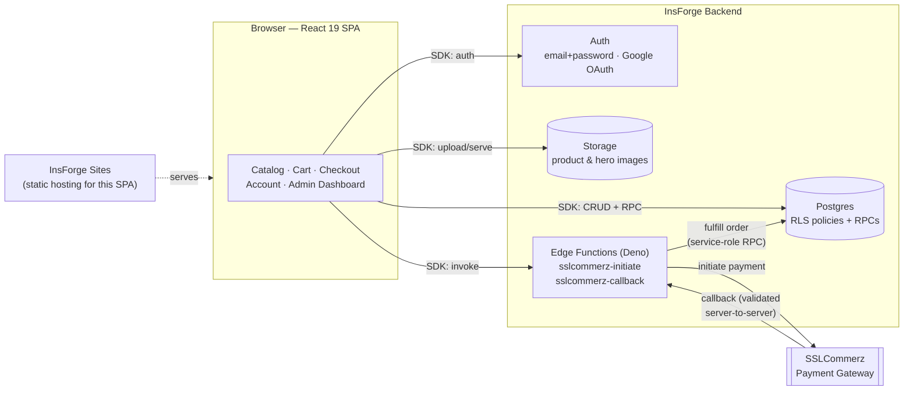

# Lagle Janaben

> Gifts that connect Hearts — A full-featured e-commerce web application for a Bangladeshi gift shop.

**🔗 Live demo: [tup5n9bf.insforge.site](https://tup5n9bf.insforge.site)**

## Architecture

The frontend is a static React SPA that talks directly to [InsForge](https://insforge.dev) over its SDK — there is no custom backend server. Every write that touches money (pricing, inventory, promo redemption) happens inside Postgres functions, never trusted from the browser.



**Why it's shaped this way:**
- **No app server to run or patch.** The SPA is static; InsForge is the entire backend.
- **Row Level Security everywhere.** Every table enforces who can read/write which rows at the database layer, not in application code — see [`migrations/`](migrations/).
- **Money never trusts the client.** Cart prices, promo discounts, shipping, and inventory are recomputed inside Postgres RPCs (`place_order`, `create_pending_gateway_order`, `fulfill_gateway_order`, `cancel_own_order`) — the browser only ever sends product IDs and quantities.
- **Payment secrets never reach the browser.** The SSLCommerz store password lives only in InsForge's encrypted secrets store, read by the two edge functions in [`functions/`](functions/).

## Tech Stack

| Layer | Technology |
|-------|-----------|
| **Frontend** | React 19, TypeScript 5.8, Vite 6 |
| **Styling** | Tailwind CSS v4, Lucide React icons, Motion (Framer Motion v12) |
| **Backend** | [InsForge](https://insforge.dev) — Postgres, auth, storage, edge functions |
| **Database** | Postgres (InsForge-managed), Row Level Security on every table |
| **Payment Gateway** | SSLCommerz (Bangladesh), via an InsForge edge function |
| **Authentication** | InsForge Auth — email/password (with verification) + Google OAuth |
| **Hosting** | InsForge Sites |

## Project Structure

```
Lagle-Janaben/
├── functions/                    # InsForge edge functions (Deno)
│   ├── sslcommerz-initiate.ts    # Starts a payment session for a pending order
│   └── sslcommerz-callback.ts    # Validates & fulfills success/fail/cancel/IPN
├── migrations/                   # Versioned SQL — schema, RLS policies, RPCs
├── assets/.aistudio/             # AI Studio managed assets
├── src/                          # React + TypeScript frontend
│   ├── main.tsx                  # React root mount
│   ├── App.tsx                   # Main app — routing, state, auth, cart, admin
│   ├── types.ts                  # TypeScript interfaces
│   ├── data.ts                   # Static catalog category list
│   ├── index.css                 # Tailwind v4 + fonts
│   ├── lib/
│   │   ├── insforge.ts           # InsForge SDK client
│   │   ├── pricing.ts            # Shared cart total computation (display only)
│   │   ├── validation.ts         # Shared email/BD-phone validation
│   │   └── api/                  # Typed wrappers around the InsForge SDK
│   │       ├── auth.ts, products.ts, orders.ts, customers.ts, accounts.ts
│   │       ├── promoCodes.ts, shippingSettings.ts, heroSlides.ts
│   └── components/
│       ├── AdminDashboard.tsx    # Admin panel (8 tabs: overview, products, orders, customers, accounts, promos, shipping, hero)
│       ├── CartDrawer.tsx        # Slide-over cart with promo code support
│       ├── CatalogView.tsx       # Product grid — hero slider, search, filters, pagination
│       ├── CheckoutView.tsx      # Checkout — COD & SSLCommerz
│       ├── MyOrdersView.tsx      # Signed-in order history + self-cancel with live countdown
│       ├── GoogleAuthButton.tsx  # Google OAuth button
│       ├── Login.tsx             # Login form
│       ├── Logo.tsx              # SVG logo component
│       ├── Navbar.tsx            # Sticky header, admin-gated nav, cart badge, user menu
│       ├── ProductDetailView.tsx # Product detail with gallery, add-to-cart
│       └── Register.tsx          # Registration with BD phone, password, email-code verification
├── .env.example                  # VITE_INSFORGE_URL / VITE_INSFORGE_ANON_KEY template
├── index.html                    # SPA entry point
├── package.json                  # npm dependencies & scripts
├── tsconfig.json                 # TypeScript config
├── vercel.json                   # SPA rewrite rule for InsForge Sites hosting
└── vite.config.ts                # Vite build config (React + Tailwind)
```

## Features

- **Product Catalog** — Search, category filter, price range, sort, pagination, hero slider
- **Product Detail** — Image gallery, quantity selector, add-to-cart, instant checkout, related products
- **Shopping Cart** — Slide-over drawer, quantity controls, promo codes, real-time totals
- **Checkout** — Cash on Delivery today; SSLCommerz (cards, bKash, Nagad, Rocket) wired up and ready, shown as "Coming Soon" until live merchant credentials are configured
- **My Orders** — Signed-in customers see their own order history and can self-cancel a Pending/Processing order within 2 hours, with a live countdown
- **Authentication** — Email/password (with email verification) & Google OAuth, via InsForge Auth
- **Admin Dashboard** — 8-tab panel: Overview, Products, Orders, Customers, Accounts, Promo Codes, Shipping, Hero Slider (role-gated)
- **Accounts directory** — Admins can see every registered account, not just people who've ordered
- **CRM** — Server-maintained customer profiles (order count & total spent), never client-written
- **Inventory** — Server-side atomic decrement on order (and automatic restore on cancellation), "Out of Stock" status
- **Security** — Every table has Row Level Security; pricing, promo validation, and inventory are always recomputed server-side (Postgres RPCs), never trusted from the client

## Database Schema

`products` | `orders` | `order_items` | `customers` | `profiles` | `promo_codes` | `shipping_settings` | `hero_slides`

Plus InsForge's built-in `auth.users`. See [`migrations/`](migrations/) for the full schema, RLS policies, and order-fulfillment RPCs (`place_order`, `create_pending_gateway_order`, `fulfill_gateway_order`, `cancel_own_order`, `get_order_by_id`, `validate_promo`, `sync_my_profile`).

## Getting Started

### Prerequisites

- Node.js 22+
- An [InsForge](https://insforge.dev) project (`npx @insforge/cli login` then `npx @insforge/cli link`)
- SSLCommerz sandbox or live store credentials (optional — Cash on Delivery works without them)

### Setup

1. Clone the repo and install dependencies: `npm install`
2. Copy `.env.example` to `.env` and fill in `VITE_INSFORGE_URL` / `VITE_INSFORGE_ANON_KEY` (from `npx @insforge/cli current` and `npx @insforge/cli secrets get ANON_KEY`)
3. Apply the database schema: `npx @insforge/cli db migrations up --all`
4. Deploy the edge functions: `npx @insforge/cli functions deploy sslcommerz-initiate --file functions/sslcommerz-initiate.ts` and the same for `sslcommerz-callback`
5. Set SSLCommerz secrets: `npx @insforge/cli secrets add SSLCOMMERZ_STORE_ID ...` / `SSLCOMMERZ_STORE_PASSWORD ...` / `SSLCOMMERZ_IS_SANDBOX true`
6. Promote your admin account: after signing up once in the app, run a migration or `db query` to insert `{ id: <your auth user id>, role: 'admin' }` into `profiles`
7. Run `npm run dev` for development

### Deployment

```bash
npm run build
npx @insforge/cli deployments env set VITE_INSFORGE_URL <url>
npx @insforge/cli deployments env set VITE_INSFORGE_ANON_KEY <key>
npx @insforge/cli deployments deploy .
```
