# Lagle Janaben

> Gifts that connect Hearts — A full-featured e-commerce web application for a Bangladeshi gift shop.

**🔗 Live demo: [lagle-janaben.vercel.app](https://lagle-janaben.vercel.app)**

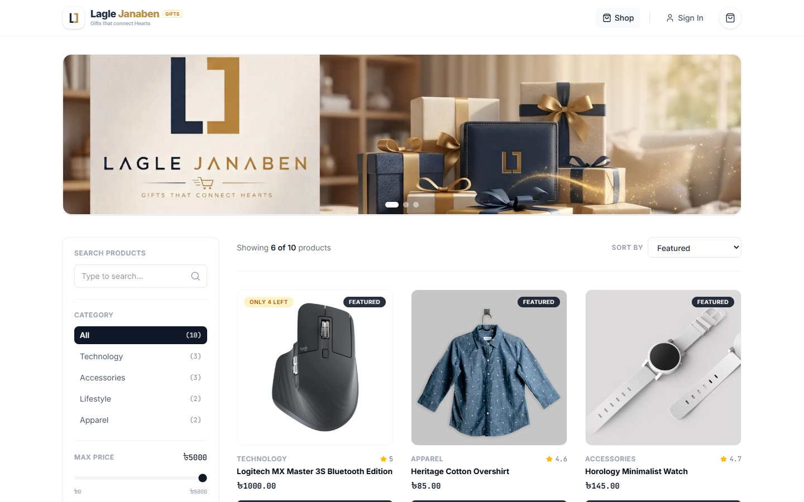

## Screenshots

| Catalog | Product Detail |
|:---:|:---:|
| 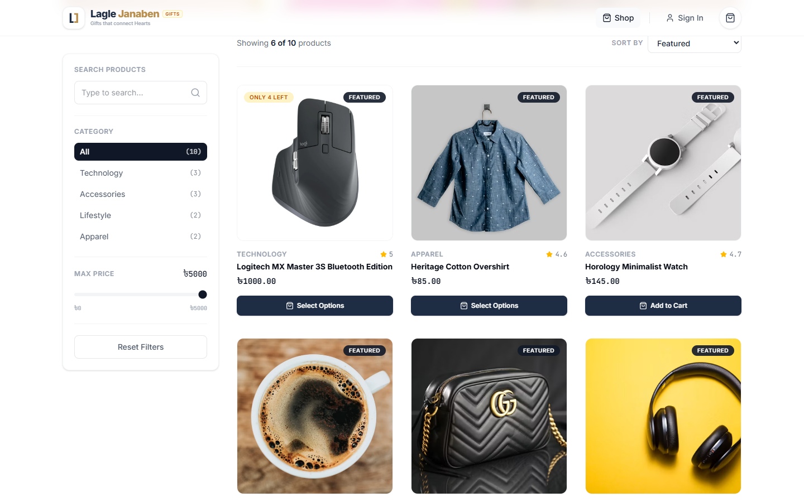 | 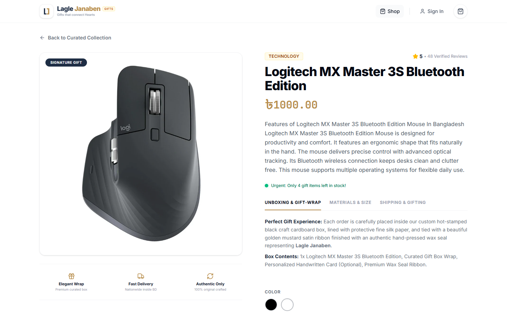 |
| **Cart** | **Checkout** |
| 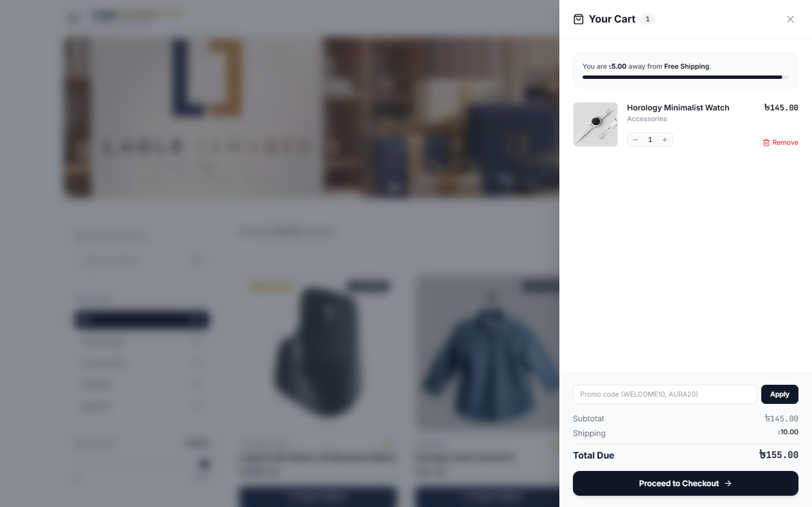 | 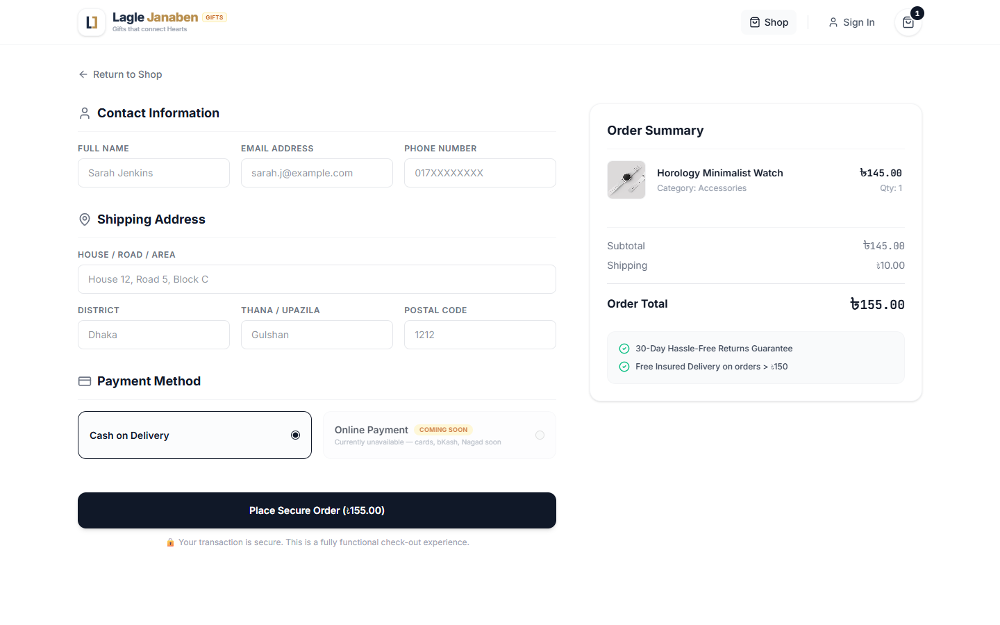 |

<p align="center">
  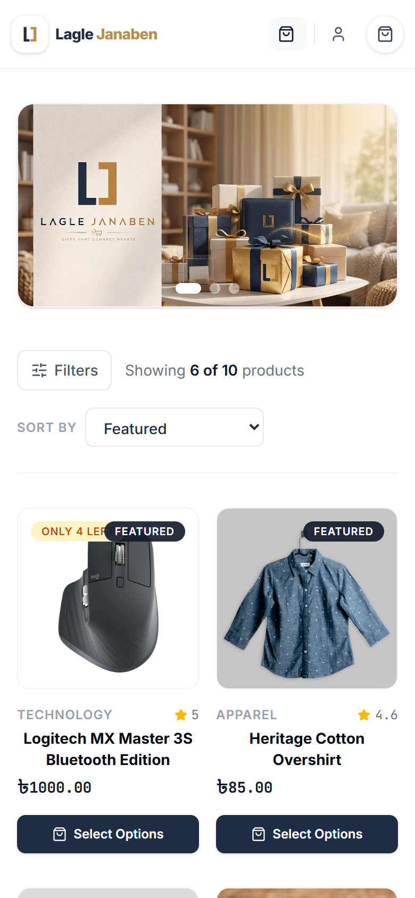
  <br>
  <em>Responsive mobile layout</em>
</p>

### Admin Dashboard

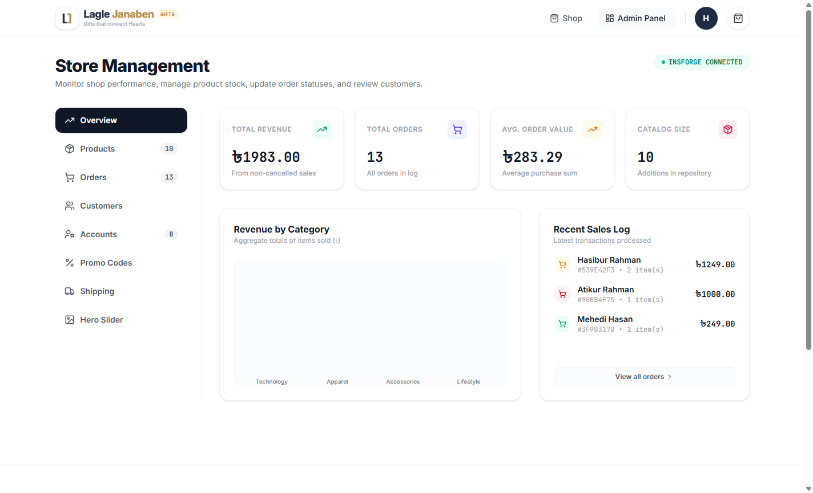

| Products | Orders |
|:---:|:---:|
| 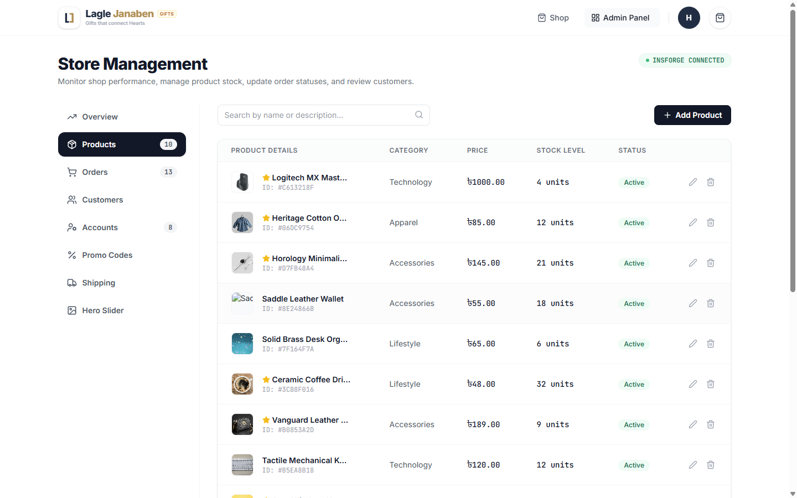 | 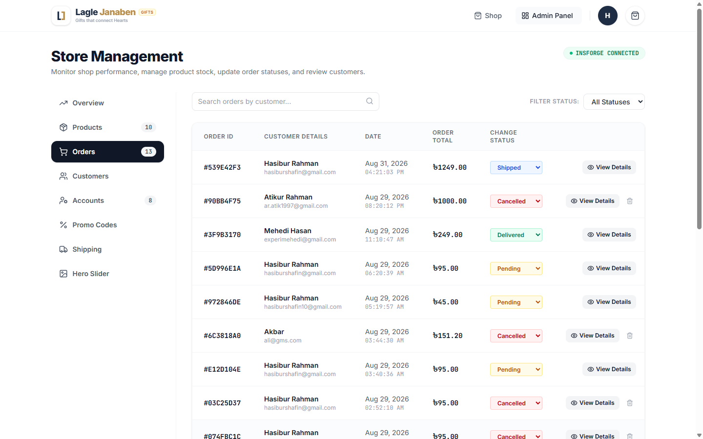 |
| **Customers** | **Accounts** |
| 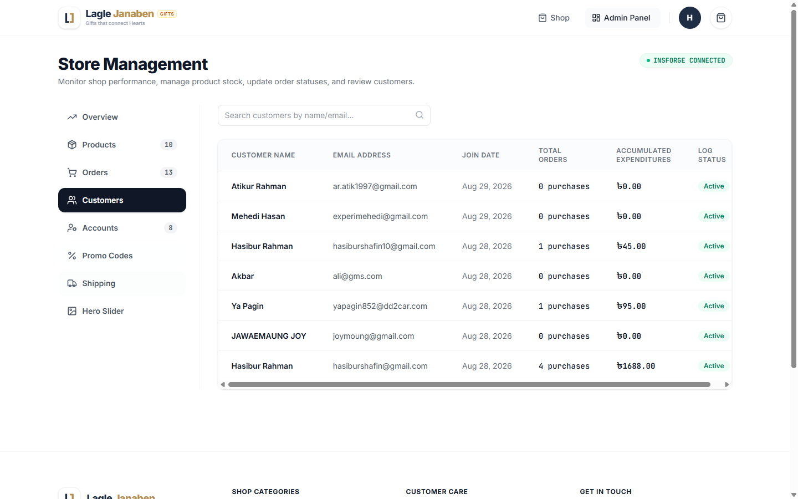 | 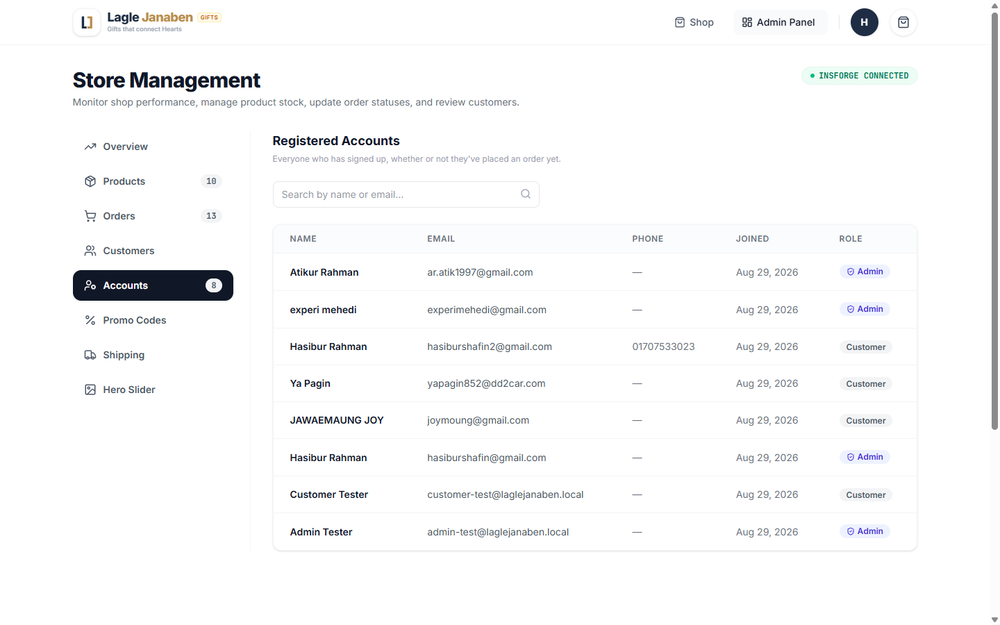 |
| **Promo Codes** | **Shipping** |
| 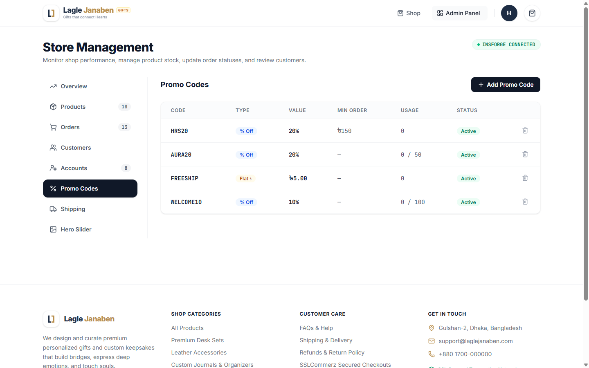 | 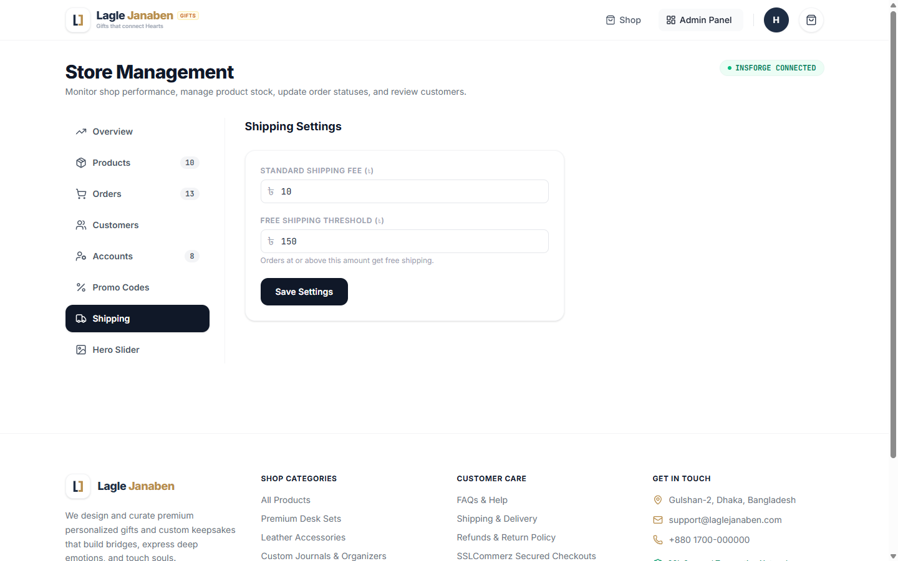 |
| **Hero Slider** | |
| 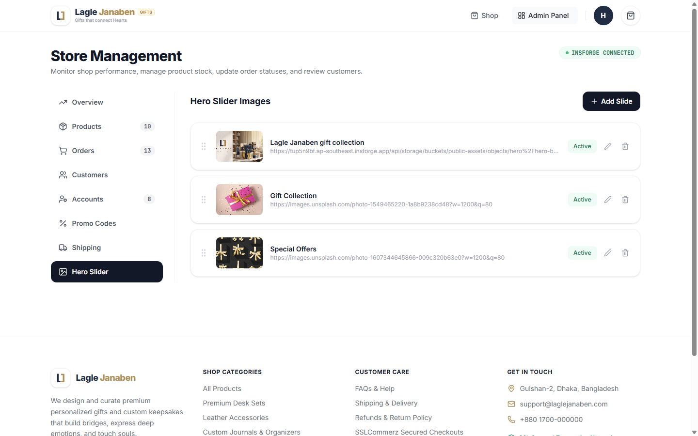 | |

## Architecture

The frontend is a static React SPA that talks directly to [Supabase](https://supabase.com) over `@supabase/supabase-js` — there is no custom backend server. Every write that touches money (pricing, inventory, promo redemption) happens inside Postgres functions, never trusted from the browser.

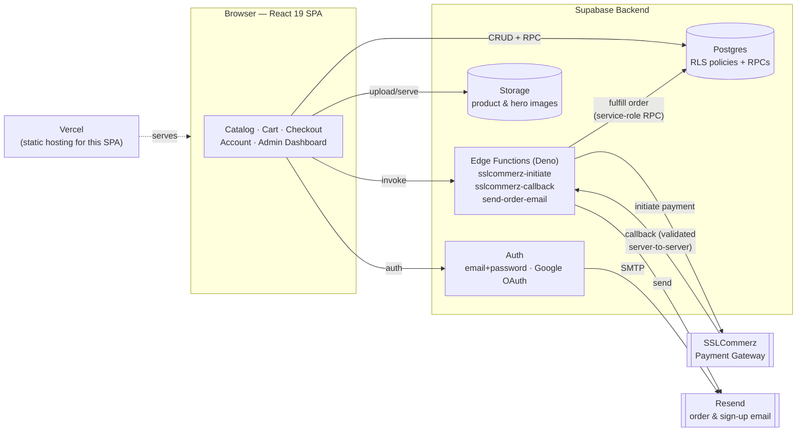
```mermaid
flowchart LR
    subgraph Browser["Browser — React 19 SPA"]
        UI["Catalog · Cart · Checkout
Account · Admin Dashboard"]
    end

    subgraph Supabase["Supabase Backend"]
        Auth["Auth
email+password · Google OAuth"]
        DB[("Postgres
RLS policies + RPCs")]
        Storage[("Storage
product & hero images")]
        Functions["Edge Functions (Deno)
sslcommerz-initiate
sslcommerz-callback
send-order-email"]
    end

    Gateway[["SSLCommerz
Payment Gateway"]]
    Resend[["Resend
order & sign-up email"]]
    Vercel["Vercel
(static hosting for this SPA)"]

    UI -- "auth" --> Auth
    UI -- "CRUD + RPC" --> DB
    UI -- "upload/serve" --> Storage
    UI -- "invoke" --> Functions
    Functions -- "initiate payment" --> Gateway
    Gateway -- "callback (validated
server-to-server)" --> Functions
    Functions -- "fulfill order
(service-role RPC)" --> DB
    Functions -- "send" --> Resend
    Auth -- "SMTP" --> Resend
    Vercel -. serves .-> Browser
```

**Why it's shaped this way:**
- **No app server to run or patch.** The SPA is static; Supabase is the entire backend.
- **Row Level Security everywhere.** Every table enforces who can read/write which rows at the database layer, not in application code — see [`supabase/migrations/`](supabase/migrations/).
- **Money never trusts the client.** Cart prices, promo discounts, shipping, and inventory are recomputed inside Postgres RPCs (`place_order`, `create_pending_gateway_order`, `fulfill_gateway_order`, `cancel_own_order`) — the browser only ever sends product IDs and quantities. Internal RPCs like `fulfill_gateway_order` can only be called with the service-role key, from the edge functions.
- **Secrets never reach the browser.** The SSLCommerz store password and the Resend API key live only in Supabase's edge function secrets, read by the functions in [`supabase/functions/`](supabase/functions/).

## Tech Stack

| Layer | Technology |
|-------|-----------|
| **Frontend** | React 19, TypeScript 5.8, Vite 6 |
| **Styling** | Tailwind CSS v4, Lucide React icons, Motion (Framer Motion v12) |
| **Backend** | [Supabase](https://supabase.com) — Postgres, auth, storage, edge functions |
| **Database** | Postgres 17 (Supabase-managed), Row Level Security on every table |
| **Payment Gateway** | SSLCommerz (Bangladesh), via a Supabase edge function |
| **Authentication** | Supabase Auth — email/password (with 6-digit email code) + Google OAuth |
| **Email** | [Resend](https://resend.com) — order emails via an edge function, sign-up codes via SMTP |
| **Hosting** | Vercel |

## Project Structure

```
Lagle-Janaben/
├── supabase/
│   ├── config.toml               # Supabase CLI config (auth, edge function JWT settings)
│   ├── migrations/               # Versioned SQL — schema, RLS policies, RPCs, grants
│   ├── templates/                # Auth email templates (sign-up verification code)
│   └── functions/                # Edge functions (Deno)
│       ├── _shared/              # CORS/service-role client + order email templates & Resend sender
│       ├── sslcommerz-initiate/  # Starts a payment session for a pending order
│       ├── sslcommerz-callback/  # Validates & fulfills success/fail/cancel/IPN
│       └── send-order-email/     # Order confirmation / cancellation emails
├── assets/.aistudio/             # AI Studio managed assets
├── docs/screenshots/             # README preview images
├── src/                          # React + TypeScript frontend
│   ├── main.tsx                  # React root mount
│   ├── App.tsx                   # Main app — routing, state, auth, cart, admin
│   ├── types.ts                  # TypeScript interfaces
│   ├── data.ts                   # Static catalog category list
│   ├── index.css                 # Tailwind v4 + fonts
│   ├── lib/
│   │   ├── supabase.ts           # Supabase client
│   │   ├── pricing.ts            # Shared cart total computation (display only)
│   │   ├── validation.ts         # Shared email/BD-phone validation
│   │   └── api/                  # Typed wrappers around supabase-js
│   │       ├── auth.ts, products.ts, orders.ts, customers.ts, accounts.ts
│   │       ├── promoCodes.ts, shippingSettings.ts, heroSlides.ts, notifications.ts
│   └── components/
│       ├── AdminDashboard.tsx    # Admin panel (8 tabs: overview, products, orders, customers, accounts, promos, shipping, hero)
│       ├── CartDrawer.tsx        # Slide-over cart with promo code support
│       ├── CatalogView.tsx       # Product grid — hero slider, search, filters, pagination
│       ├── CheckoutView.tsx      # Checkout — COD & SSLCommerz
│       ├── MyOrdersView.tsx      # Signed-in order history + self-cancel with live countdown
│       ├── GoogleAuthButton.tsx  # Google OAuth button
│       ├── Login.tsx             # Login form
│       ├── Logo.tsx              # SVG logo component
│       ├── Navbar.tsx            # Sticky header, admin-gated nav, cart badge, user menu
│       ├── ProductDetailView.tsx # Product detail with gallery, add-to-cart
│       └── Register.tsx          # Registration with BD phone, password, email-code verification
├── .env.example                  # VITE_SUPABASE_URL / VITE_SUPABASE_ANON_KEY template
├── index.html                    # SPA entry point
├── package.json                  # npm dependencies & scripts
├── tsconfig.json                 # TypeScript config
├── vercel.json                   # SPA rewrite rule for Vercel
└── vite.config.ts                # Vite build config (React + Tailwind)
```

## Features

- **Product Catalog** — Search, category filter, price range, sort, pagination, hero slider
- **Product Detail** — Image gallery, quantity selector, add-to-cart, instant checkout, related products
- **Shopping Cart** — Slide-over drawer, quantity controls, promo codes, real-time totals
- **Checkout** — Cash on Delivery today; SSLCommerz (cards, bKash, Nagad, Rocket) wired up and ready, shown as "Coming Soon" until live merchant credentials are configured
- **My Orders** — Signed-in customers see their own order history and can self-cancel a Pending/Processing order within 2 hours, with a live countdown
- **Authentication** — Email/password (with email verification) & Google OAuth, via Supabase Auth
- **Admin Dashboard** — 8-tab panel: Overview, Products, Orders, Customers, Accounts, Promo Codes, Shipping, Hero Slider (role-gated)
- **Accounts directory** — Admins can see every registered account, not just people who've ordered
- **CRM** — Server-maintained customer profiles (order count & total spent), never client-written
- **Inventory** — Server-side atomic decrement on order (and automatic restore on cancellation), "Out of Stock" status
- **Security** — Every table has Row Level Security; pricing, promo validation, and inventory are always recomputed server-side (Postgres RPCs), never trusted from the client

## Database Schema

`products` | `orders` | `order_items` | `customers` | `profiles` | `promo_codes` | `shipping_settings` | `hero_slides`

Plus Supabase's built-in `auth.users`. See [`supabase/migrations/`](supabase/migrations/) for the full schema, RLS policies, and order-fulfillment RPCs (`place_order`, `create_pending_gateway_order`, `fulfill_gateway_order`, `cancel_own_order`, `get_order_by_id`, `validate_promo`, `sync_my_profile`).

## Getting Started

### Prerequisites

- Node.js 22+
- A [Supabase](https://supabase.com) project and the CLI (`npx supabase login`, then `npx supabase link --project-ref <ref>`)
- A [Resend](https://resend.com) API key and verified sending domain (order emails and sign-up codes)
- A Google OAuth client ID/secret, if you want Google sign-in
- SSLCommerz sandbox or live store credentials (optional — Cash on Delivery works without them)

### Setup

1. Clone the repo and install dependencies: `npm install`
2. Copy `.env.example` to `.env.local` and fill in `VITE_SUPABASE_URL` / `VITE_SUPABASE_ANON_KEY` (Supabase dashboard → Project Settings → API)
3. Apply the database schema: `npx supabase db push`
4. Deploy the edge functions: `npx supabase functions deploy` (JWT verification is off per `supabase/config.toml`; each function does its own checks)
5. Set edge function secrets:
   ```bash
   npx supabase secrets set SITE_URL=https://your-site.vercel.app      RESEND_API_KEY=re_... EMAIL_FROM="Lagle Janaben <orders@your-domain.com>"      SSLCOMMERZ_STORE_ID=... SSLCOMMERZ_STORE_PASSWORD=... SSLCOMMERZ_IS_SANDBOX=true
   ```
6. In the Supabase dashboard → Authentication: set the Site URL and redirect URLs to your site, add Resend as custom SMTP, paste [`supabase/templates/confirmation.html`](supabase/templates/confirmation.html) as the "Confirm signup" template (it sends a 6-digit code), and enable the Google provider
7. Promote your admin account: after signing up once in the app, set `role = 'admin'` on your row in `profiles` (SQL editor)
8. Run `npm run dev` for development

### Deployment

```bash
npx vercel link
npx vercel env add VITE_SUPABASE_URL production
npx vercel env add VITE_SUPABASE_ANON_KEY production
npx vercel deploy --prod
```
